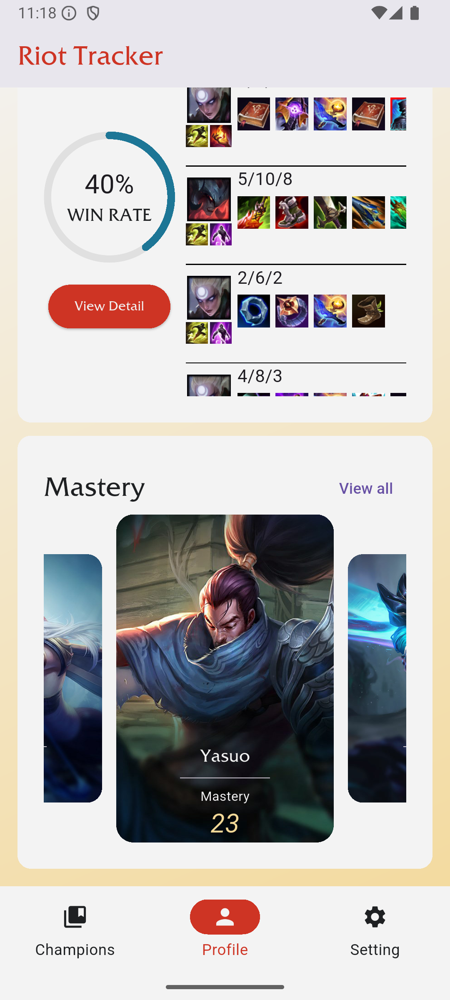
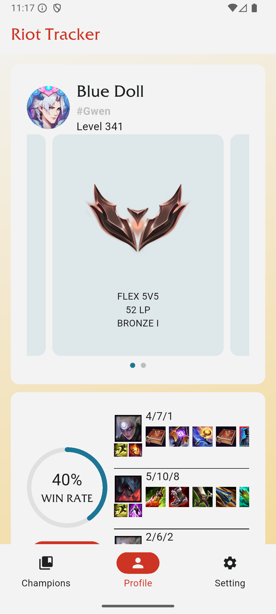
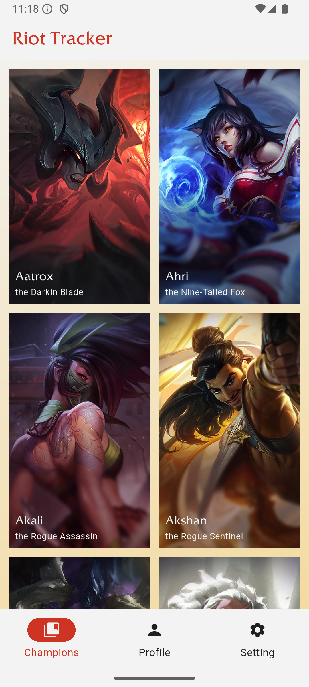
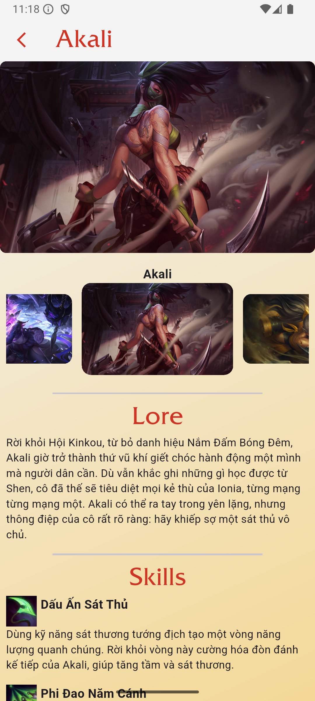

# 📱 Riot Tracker

A Flutter mobile application that allows users to track their Riot Games account, including LoL, TFT, Val. This app can show match history, champion list, and detailed champion information.

---

## 🚀 Features

- Search summoner by Riot ID
- View match history
- Champion details (skills, skins, stats)
- Basic analytics (KDA, win rate)
- Champion images from Data Dragon CDN
- ...

---

## 🛠️ Tech Stack

- **Flutter (Dart)** – Cross-platform development
- **GetX** – State management & dependency injection
- **Clean Architecture** – Data / Domain / Presentation
- **RESTful API** – Riot Games API
- JSON parsing & model mapping

---

## ⚡ Performance Optimizations

- Lazy loading with `ListView.builder`
- Reduced widget rebuilds using reactive state (GetX)
- API caching → ~30% faster loading
- Optimized image loading via CDN
- Efficient async handling (Future / async-await)

---

## 📸 Screenshots







---

## 📂 Project Structure
lib/

├── data/ # API, models, repository implementations

├── domain/ # Entities, use cases

├── presentation/ # UI, controllers (GetX)

├── core/ # Constants, utils


---

## 🧠 Architecture

This project follows **Clean Architecture**:

- **Presentation Layer** → UI + GetX Controllers
- **Domain Layer** → Business logic (UseCases, Entities)
- **Data Layer** → API calls & repository implementations

---

## 🧪 Future Improvements

- Advanced analytics (charts, performance trends)
- Multi-region support
- Support more game ( TFT, Val, LOR )
---

## 📦 Installation

```bash
git clone https://github.com/long200321/riot-tracker.git
cd riot-tracker
flutter pub get
flutter run
